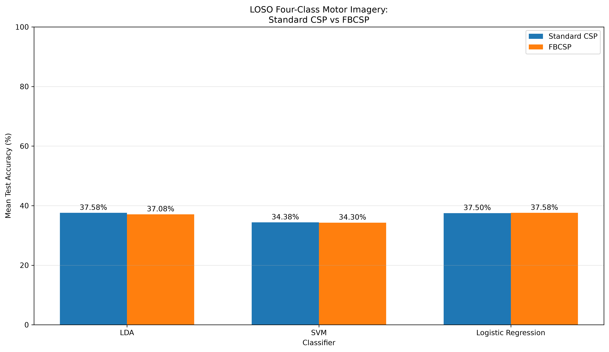
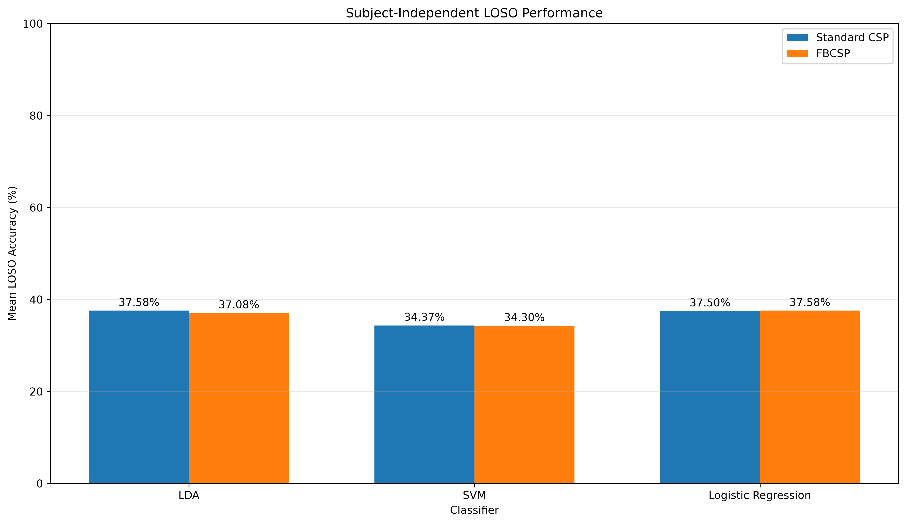

# EIDOS-BCI


A modular EEG signal processing framework for Brain–Computer Interface (BCI) research.
## Overview

EIDOS-BCI is a Python-based framework for processing and analyzing EEG signals using MNE-Python.

The project is being developed as part of **IEEE ESPC 2026** and focuses on **Motor Imagery (MI) EEG analysis**, with particular emphasis on subject-independent classification.

The long-term goal is to develop a foundation for:

- Motor Imagery Brain–Computer Interfaces
- EEG signal processing
- Machine learning for BCI
- Real-time BCI systems
- Brain–Computer Interface and Virtual Reality research

---

# Current Research

The current experiment evaluates four-class motor imagery EEG classification using:

- Common Spatial Patterns (CSP)
- Filter Bank Common Spatial Patterns (FBCSP)
- Linear Discriminant Analysis (LDA)
- Support Vector Machine (SVM)
- Logistic Regression

The experiment evaluates both:

- Within-subject classification
- Subject-independent classification using Leave-One-Subject-Out (LOSO)

The primary research question is:

> Does incorporating multiple frequency bands through FBCSP improve four-class motor imagery EEG classification for previously unseen subjects compared with Standard CSP?
---

# Installation

Clone the repository:

bash
git clone https://github.com/Shihab-Eldin-Ibrahim/EIDOS-BCI.git
cd EIDOS-BCI
---
# Dataset

The project uses:

**BCI Competition IV — Dataset 2a**

The dataset contains EEG recordings from nine subjects:

`A01 – A09`

## Motor Imagery Classes

The experiment uses four motor imagery classes:

| Class | Motor Imagery |
| ----- | ------------- |
| 1     | Left hand     |
| 2     | Right hand    |
| 3     | Feet          |
| 4     | Tongue        |

## Recording Information

The BCI Competition IV Dataset 2a recordings contain:

* 22 EEG channels
* 3 EOG channels
* 25 total channels
* Sampling frequency: 250 Hz
* Approximately 2690 seconds of recording for `A01T.gdf`

The dataset is stored locally and is not included in the repository.

---

# Dataset Events

The GDF recordings contain event markers used to identify trials and experimental conditions.

| Code  | Description            |
| ----- | ---------------------- |
| 276   | Idle EEG — eyes open   |
| 277   | Idle EEG — eyes closed |
| 768   | Start of trial         |
| 769   | Left-hand imagery      |
| 770   | Right-hand imagery     |
| 771   | Foot imagery           |
| 772   | Tongue imagery         |
| 1023  | Rejected trial         |
| 1072  | Eye movements          |
| 32766 | Start of new run       |

Motor imagery trials are extracted from the continuous EEG recording using the event markers.

---

# Processing Pipeline

The EIDOS-BCI processing pipeline is organized into modular stages:

```text
BCI Competition IV Dataset 2a
            │
            ▼
       EEG Loading
            │
            ▼
     Dataset Metadata
            │
            ▼
     Event Extraction
            │
            ▼
    Motor Imagery Epoching
            │
            ▼
      EEG Preprocessing
            │
       ┌────┴────┐
       ▼         ▼
   Standard     FBCSP
      CSP         │
       │          ▼
       │    Multiple Frequency
       │         Bands
       │          │
       │          ▼
       │         CSP
       │          │
       └────┬─────┘
            ▼
        Features
            │
            ▼
      Classification
            │
      ┌─────┼─────────────┐
      ▼     ▼             ▼
     LDA   SVM   Logistic Regression
      │     │             │
      └─────┼─────────────┘
            ▼
        Evaluation
            │
            ▼
     Statistical Analysis
```

## Classification Window

EEG signMotor imagery trials are segmented using a **1–4 second window following the onset of the motor imagery event**.

The same classification window is used for both Standard CSP and FBCSP to ensure a consistent comparison between the two approaches.

---

# Common Spatial Patterns

Common Spatial Patterns (CSP) is used to extract spatial features from the EEG signals.

CSP learns spatial filters that emphasize differences in signal variance between motor imagery classes.

The extracted CSP features are then provided to the machine-learning classifiers.

For subject-independent evaluation, CSP filters are fitted using the training subjects only and then applied to the held-out subject.

---

# Filter Bank Common Spatial Patterns

Filter Bank Common Spatial Patterns (FBCSP) extends the Standard CSP approach by applying CSP across multiple frequency bands.

The purpose of the experiment is to determine whether frequency-specific spatial information improves classification performance when the system is evaluated on previously unseen subjects.

The comparison is therefore:

```text 
Standard CSP
     │
     ▼
Spatial Features
     │
     ▼
Classifier
     │
     ▼
Prediction


FBCSP
     │
     ▼
Multiple Frequency Bands
     │
     ▼
CSP Features
     │
     ▼
Classifier
     │
     ▼
Prediction
```

---

# Classifiers

Three classifiers are evaluated:

### Linear Discriminant Analysis

LDA is used as a linear baseline classifier for CSP and FBCSP features.

### Support Vector Machine

SVM is evaluated as an additional conventional classifier for comparison.

### Logistic Regression

Logistic Regression provides another linear classification baseline.

---

# Evaluation

## Within-Subject Evaluation

Within-subject evaluation trains and tests the model using data from the same participant.

This measures performance when subject-specific EEG characteristics are available during training.

---

## Subject-Independent Evaluation

The primary focus of the experiment is subject-independent classification.

**Leave-One-Subject-Out (LOSO)** validation is used.

For each fold:

```text
9 Subjects
   │
   ├── 8 Subjects → Training
   │
   └── 1 Subject → Testing
```

The process is repeated until every subject has been used as the held-out test subject.

CSP spatial filters and classifiers are fitted exclusively on the training subjects before being applied to the unseen test subject.

This prevents information from the held-out subject from influencing the training process and provides a more realistic evaluation of BCI generalization to new users.

---

# Results

The completed experiment compares Standard CSP and FBCSP under Leave-One-Subject-Out (LOSO) evaluation.

## LOSO Performance

| Classifier          | Standard CSP |  FBCSP |   Change |
| ------------------- | -----------: | -----: | -------: |
| LDA                 |       37.58% | 37.08% | -0.50 pp |
| SVM                 |       34.38% | 34.30% | -0.08 pp |
| Logistic Regression |       37.50% | 37.58% | +0.08 pp |

Across the three evaluated classifiers:

```text 
Standard CSP mean: 36.48%
FBCSP mean:        36.32%

Overall change:    -0.17 percentage points
```

The highest Standard CSP LOSO accuracy was obtained by **LDA (37.58%)**.

The highest FBCSP LOSO accuracy was obtained by **Logistic Regression (37.58%)**.

These results show that the tested FBCSP configuration did not produce a meaningful improvement in average subject-independent classification accuracy compared with Standard CSP.

---

# Results Visualization

## LOSO Performance Comparison

The following figure compares Standard CSP and FBCSP performance across the evaluated classifiers under Leave-One-Subject-Out validation.



## Generalization Gap

The following figure illustrates the performance difference between within-subject evaluation and subject-independent LOSO evaluation.



---

# Confusion Matrices

Confusion matrices were generated for each subject, method, and classifier to examine class-level prediction behavior.

The evaluated methods are:

- Standard CSP
- FBCSP

The evaluated classifiers are:

- LDA
- SVM
- Logistic Regression

Confusion matrices are available in:

`results/four_class/confusion_matrices/`

---

# Statistical Analysis

The Standard CSP and FBCSP results were compared at the subject level.

The statistical analysis includes:

* Shapiro-Wilk normality testing
* Paired t-tests
* Wilcoxon signed-rank tests
* Cohen's d effect size

## Statistical Results

| Classifier          | Mean Change | Paired t-test p-value | Wilcoxon p-value | Cohen's d |
| ------------------- | ----------: | --------------------: | ---------------: | --------: |
| LDA                 |    -0.50 pp |                0.8162 |           0.8203 |   -0.0801 |
| SVM                 |    -0.08 pp |                0.9721 |           0.9609 |   -0.0120 |
| Logistic Regression |    +0.08 pp |                0.9751 |           1.0000 |    0.0107 |

None of the evaluated classifiers showed a statistically significant difference between Standard CSP and FBCSP under LOSO evaluation.

All observed effect sizes were negligible.

These results indicate that the observed differences between Standard CSP and FBCSP are small relative to the variability between subjects.

---

# Generalization Gap

The experiment also compares within-subject and subject-independent performance.

| Method       | Classifier          | Within-Subject |   LOSO | Generalization Gap |
| ------------ | ------------------- | -------------: | -----: | -----------------: |
| Standard CSP | LDA                 |         60.99% | 37.58% |           23.42 pp |
| FBCSP        | LDA                 |         67.02% | 37.08% |           29.95 pp |
| Standard CSP | SVM                 |         59.60% | 34.38% |           25.23 pp |
| FBCSP        | SVM                 |         68.25% | 34.30% |           33.95 pp |
| Standard CSP | Logistic Regression |         60.22% | 37.50% |           22.72 pp |
| FBCSP        | Logistic Regression |         67.37% | 37.58% |           29.79 pp |

The results demonstrate a substantial reduction in performance when moving from within-subject evaluation to previously unseen subjects.

This **generalization gap** highlights the strong inter-subject variability present in motor imagery EEG.

Although FBCSP achieved higher within-subject accuracy in the evaluated experiments, this improvement did not translate into improved subject-independent performance under LOSO evaluation.

---

# Main Finding

The main finding of the experiment is:

> Under the tested experimental conditions, FBCSP did not provide a statistically significant improvement over Standard CSP for subject-independent four-class motor imagery EEG classification.

FBCSP produced a small overall decrease of approximately **0.17 percentage points** across the evaluated classifiers.

The observed differences were small, with negligible effect sizes and no statistically significant improvement under the LOSO evaluation protocol.

Therefore, the results do not provide statistical evidence that the tested FBCSP configuration consistently improves cross-subject classification.

---

# Research Conclusion

The experiment demonstrates the difficulty of subject-independent motor imagery EEG classification.

Although FBCSP provides additional frequency-specific spatial information, using multiple frequency bands alone did not overcome the inter-subject variability observed in the dataset.

The substantial generalization gap between within-subject and LOSO performance suggests that subject variability remains one of the major challenges in developing robust motor imagery BCI systems.

The results suggest that improving subject-independent BCI performance will likely require techniques beyond frequency-bank spatial filtering.

Potential approaches include:

* Subject normalization
* Transfer learning
* Domain adaptation
* Regularized CSP
* Riemannian geometry-based EEG representations
* Adaptive spatial filtering
* Deep learning
* Hybrid BCI approaches

---

# Limitations

The current experiment has several limitations:

* Only one public dataset was evaluated.
* The FBCSP frequency-bank configuration was fixed.
* CSP dimensionality was fixed.
* Only three conventional classifiers were evaluated.
* The experiment contains nine subjects.
* The experiment focuses on four-class motor imagery.
* Results may depend on the selected preprocessing and feature-extraction configuration.

Therefore, the conclusions should be interpreted within the specific experimental conditions evaluated in EIDOS-BCI.

The results should not be interpreted as evidence that all FBCSP implementations fail to improve BCI classification.

---

# Future Work

Future development of EIDOS-BCI will focus on improving subject-independent BCI performance.

Planned research directions include:

1. Optimized frequency-band selection
2. Regularized CSP
3. Subject normalization
4. Transfer learning
5. Domain adaptation
6. Riemannian geometry-based EEG representations
7. Adaptive spatial filtering
8. Deep-learning approaches for cross-subject EEG
9. Evaluation on additional independent EEG datasets
10. Real-time BCI experimentation

The long-term objective is to investigate how EEG-based BCI systems can become more robust across different users and environments.

---

# Project Structure

The project is organized into modular components for EEG loading, preprocessing, analysis, machine learning, and experimental evaluation.

```text
EIDOS-BCI/
│
├── analysis/
│   └── ...
│
├── core/
│   ├── __init__.py
│   ├── loader.py
│   └── metadata.py
│
├── preprocessing/
│   └── ...
│
├── results/
│   └── four_class/
│       ├── confusion_matrices/
│       ├── cross_subject/
│       │   ├── confusion_matrices/
│       │   ├── plots/
│       │   ├── statistical_tests/
│       │   ├── fbcsp_loso_results.csv
│       │   ├── loso_comparison.csv
│       │   ├── standard_csp_loso_results.csv
│       │   └── subject_results.csv
│       │
│       ├── final_analysis/
│       │   ├── final_method_summary.csv
│       │   ├── generalization_gap.csv
│       │   └── generalization_gap.png
│       │
│       ├── final_conclusion/
│       │   ├── final_research_conclusion.txt
│       │   └── final_research_summary.csv
│       │
│       ├── four_class_statistical/
│       │   ├── four_class_improvements.png
│       │   ├── four_class_statistical_comparison.csv
│       │   ├── four_class_statistical_comparison.png
│       │   └── four_class_subject_improvements.csv
│       │
│       ├── paper_tables/
│       │   ├── table_1_within_subject_standard_csp.csv
│       │   ├── table_2_within_subject_fbcsp.csv
│       │   ├── table_3_loso_performance.csv
│       │   ├── table_4_loso_statistics.csv
│       │   ├── table_5_loso_subject_improvements.csv
│       │   └── table_6_overall_loso_summary.csv
│       │
│       ├── four_class_comparison.csv
│       ├── four_class_comparison.png
│       ├── four_class_fbcsp_results.csv
│       ├── four_class_standard_csp_results.csv
│       └── four_class_subject_results.csv
│
├── dataset/
│   └── 2a/
│
├── requirements.txt
├── LICENSE
└── README.md
```

The EEG dataset files are stored locally and are not included in the repository.

The project structure may evolve as additional processing, machine-learning, and evaluation modules are added.

---

# Results Directory

Experimental outputs are organized under:

```text
results/four_class/
```

The main result directories include:

### `paper_tables/`

Contains tables prepared for reporting and research documentation, including:

```text
table_1_within_subject_standard_csp.csv
table_2_within_subject_fbcsp.csv
table_3_loso_performance.csv
table_4_loso_statistics.csv
table_5_loso_subject_improvements.csv
table_6_overall_loso_summary.csv
```

### `cross_subject/`

Contains subject-independent LOSO results and cross-subject analysis.

### `final_analysis/`

Contains higher-level analysis, including comparisons between within-subject and subject-independent performance.

### `final_conclusion/`

Contains the generated final research conclusion and summary.

These files provide the detailed experimental results underlying the summary presented in this README.

---

# Technologies

The project currently uses:

* Python
* MNE-Python
* NumPy
* SciPy
* scikit-learn
* Pandas
* Matplotlib

---

# Project Status

## Completed

* EEG dataset loading
* Dataset metadata extraction
* Event extraction
* Motor imagery epoching
* EEG preprocessing
* Standard CSP pipeline
* FBCSP pipeline
* LDA classification
* SVM classification
* Logistic Regression classification
* Within-subject evaluation
* LOSO subject-independent evaluation
* Subject-level comparison
* Statistical testing
* Generalization-gap analysis
* Final research conclusion generation
* Paper-oriented result tables

## Future Work

* Frequency-band optimization
* Regularized CSP
* Subject normalization
* Transfer learning
* Domain adaptation
* Riemannian methods
* Deep-learning models
* Additional EEG datasets
* Real-time BCI implementation

---

# Research Context

EIDOS-BCI is being developed as a research-oriented project for **IEEE ESPC 2026**.

The project provides a modular foundation for investigating EEG-based Brain–Computer Interfaces, with a particular focus on the challenge of generalizing motor imagery classification to previously unseen subjects.

The longer-term research direction is to investigate how robust EEG-based BCI systems could contribute to real-time BCI applications and, eventually, Brain–Computer Interface / Virtual Reality research.
---

# Citation

If you use EIDOS-BCI in academic work, please cite the project as:


Shihab Eldin Ibrahim . EIDOS-BCI: A Modular EEG Signal Processing
Framework for Brain–Computer Interface Research. IEEE ESPC 2026.

---

# License

See the [LICENSE](LICENSE) file for project licensing information.

            

